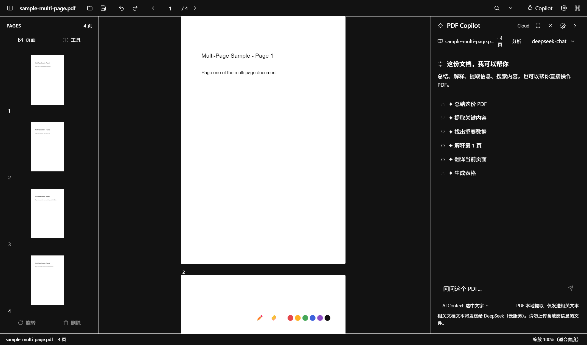

# PDF Studio AI

[简体中文](README.md) · English

A Windows-first, local-first PDF desktop workspace built with Electron, React and TypeScript. AI assistance is optional: reading and page management work without an account or API key.

[](https://github.com/nanoandluna/pdf-studio-ai/actions/workflows/ci.yml)
[](LICENSE)



## Features

- Read PDFs, zoom, navigate with thumbnails, search text and use reading mode.
- Delete, rotate, reorder and extract pages; merge and split PDFs. Undo/redo remains available after saving.
- Recognize scanned text with Tesseract.js; OCR results join the current session's search index.
- Optional OpenAI-compatible AI services: OpenAI, DeepSeek, Qwen, Ollama and custom endpoints. Bring your own model and API key.
- Ask questions with page references, summarize selections and analyze document contents. AI page edits require your confirmation.
- Four themes, command palette and resizable workspace panels.

## Status and limits

The source version is **0.4.1**. This is an early desktop project, with Windows x64 as the tested packaging target. Linux CI checks source builds and unit tests; macOS/Linux installers are not provided.

- Annotation tools were removed in 0.4.1: the previous overlay prototype was never exported to PDF. Annotation export is on the [roadmap](docs/ROADMAP.md).
- This is page-level editing, not a PDF text editor. Password-protected PDFs, digital signatures, forms and bookmarks are not guaranteed to survive editing with pdf-lib. Keep a copy of important originals.
- Individual opened files are limited to 100 MB. Dragged files open from their browser-provided bytes and use **Save As** on first save.
- OCR downloads its worker/core/language resources on first use. Full offline OCR and a saved searchable PDF text layer are not implemented.
- AI may be inaccurate. A page reference is navigation assistance, not proof that an answer is correct. Context is bounded for large documents.

## Install or develop

[Published downloads](https://github.com/nanoandluna/pdf-studio-ai/releases) may lag behind the source. Windows executables are unsigned; check the release version and hashes before running them.

Use **Node.js 24 LTS** (minimum 22.12) and npm:

```sh
git clone https://github.com/nanoandluna/pdf-studio-ai.git
cd pdf-studio-ai
npm ci
npm run dev
```

```sh
npm run check       # Script syntax, TypeScript, unit tests, production build
npm run test:smoke  # Real Electron/PDF rendering and save/undo/IPC checks (Windows)
npm run pack        # Windows x64 portable executable
npm run dist        # Windows x64 NSIS installer
```

Builds go into `dist/`; installers go into `release/<version>/`. The smoke test uses an isolated temporary profile, restores the production renderer bundle afterwards and prints its evidence directory. Run it before packaging. See [CONTRIBUTING](CONTRIBUTING.md) for architecture and development details.

## AI and privacy

In **Settings → AI**, select a provider, enter its Base URL, model and API key, then save or test. Ollama accepts a custom local model without a key. HTTP is permitted only for localhost/loopback endpoints; remote providers require HTTPS. Provider credentials are isolated and encrypted using Electron `safeStorage`. Saving fails if system encryption is unavailable.

Documents remain on your device by default. Using AI sends relevant document text, questions and chat context to the endpoint you configure. A confirmation appears before remote requests when the data notice is enabled. This setting does not change a provider's data retention policy. No project telemetry is implemented.

## Contribute

[Report a bug](https://github.com/nanoandluna/pdf-studio-ai/issues/new/choose), propose improvements or read the [roadmap](docs/ROADMAP.md). Small fixes and regression tests are welcome. Discuss large features first. Read the [security policy](SECURITY.md) before reporting a vulnerability.

MIT licensed. See [LICENSE](LICENSE) and [third-party notices](THIRD-PARTY-NOTICES.md).
